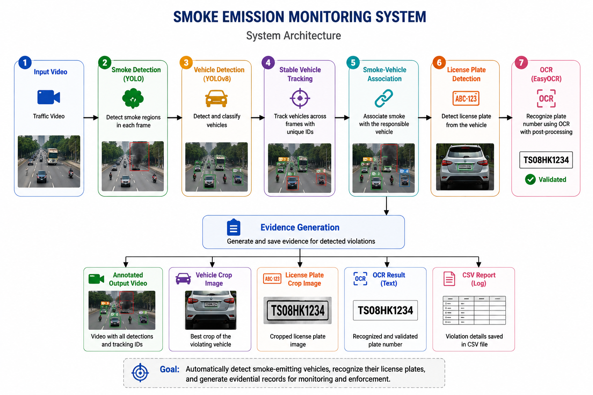
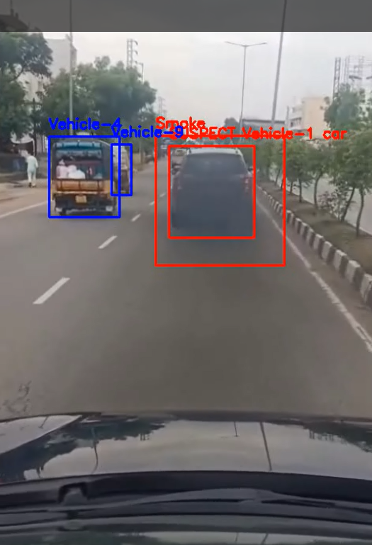
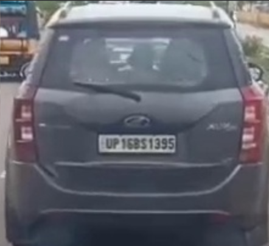
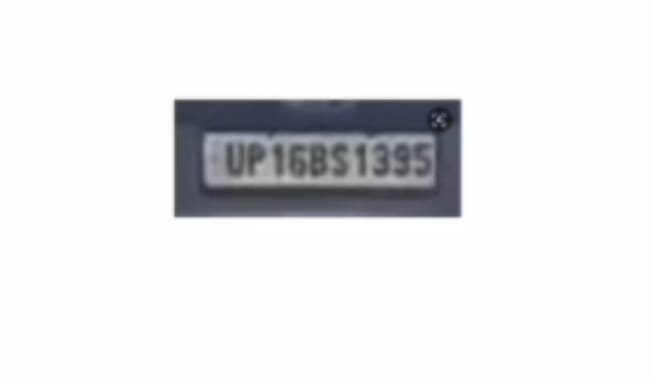
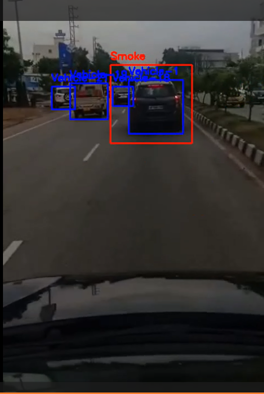

# 🚗 Smoke Emission Monitoring System

## 🎥 Project Demo


---

## 🏗️ System Architecture



An AI-powered computer vision system that automatically detects smoke-emitting vehicles from traffic videos, associates detected smoke with the responsible vehicle, recognizes the vehicle's license plate using Optical Character Recognition (OCR), and generates evidential records for monitoring and analysis.

The project combines deep learning, object detection, custom vehicle tracking, smoke-to-vehicle association, and OCR into a complete end-to-end pipeline for automated smoke emission monitoring.

---

# 📌 Project Overview

Vehicular emissions are one of the leading contributors to air pollution. Manual monitoring of smoke-emitting vehicles is labor-intensive and difficult to scale.

This project automates the monitoring process by analyzing traffic videos to:

- 🔥 Detect smoke emissions using a custom-trained YOLO model
- 🚗 Detect vehicles using YOLOv8
- 🎯 Track vehicles using a custom stable tracking algorithm
- 🔗 Associate smoke with the responsible vehicle
- 🪪 Detect and recognize vehicle license plates
- 📄 Generate annotated videos, cropped evidence images, OCR results, and CSV reports

---

# ✨ Features

- 🔥 Custom YOLO-based Smoke Detection
- 🚗 Vehicle Detection using YOLOv8
- 🎯 Custom Stable Vehicle Tracking Algorithm
- 🔗 Smoke-to-Vehicle Association
- 🪪 License Plate Detection
- 🔤 OCR-based License Plate Recognition using EasyOCR
- ✅ OCR Post-processing for Indian Vehicle Registration Plates
- 📷 Automatic Evidence Generation
- 🎥 Annotated Output Video Generation
- 📄 CSV-based Evidence Logging

---

# 🔄 System Workflow

```text
                 Input Video
                      │
                      ▼
          Smoke Detection (YOLO)
                      │
                      ▼
         Vehicle Detection (YOLOv8)
                      │
                      ▼
        Stable Vehicle Tracking
                      │
                      ▼
     Smoke-Vehicle Association
                      │
                      ▼
      License Plate Detection
                      │
                      ▼
          OCR (EasyOCR)
                      │
                      ▼
      Evidence Generation
                      │
                      ▼
 Annotated Video • Vehicle Crop • Plate Crop • CSV Report
```

---

# 📸 Sample Results

## 🔥 Smoke Detection



---

## 🚗 Vehicle Crop



---

## 🪪 License Plate Detection



---

## 🎥 Final Annotated Output



---

# 📂 Project Structure

```text
Smoke-Emission-Monitoring-System/
│
├── archive/
├── docs/
│   ├── architecture.png
│   ├── demo.gif
│   ├── smoke_detection.png
│   ├── vehicle_crop.png
│   ├── plate_crop.jpeg
│   └── annotated_output.png
│
├── input/
│   └── input.mp4
│
├── models/
│   ├── best.pt
│   ├── plate.pt
│   └── yolov8n.pt
│
├── outputs/
│   ├── annotated_output.mp4
│   └── evidence/
│
├── scripts/
├── test/
│
├── data.yaml
├── main.py
├── requirements.txt
└── README.md
```

---

# ⚙️ Technologies Used

- Python
- OpenCV
- Ultralytics YOLOv8
- EasyOCR
- NumPy

---

# 🚀 Installation

Clone the repository

```bash
git clone https://github.com/nithyasreebommagani/Smoke-Emission-Monitoring-System.git
```

Navigate to the project directory

```bash
cd Smoke-Emission-Monitoring-System
```

Install the required dependencies

```bash
pip install -r requirements.txt
```

---

# ▶️ Usage

### Step 1

Place your traffic video inside the **input** folder and rename it as:

```text
input.mp4
```

### Step 2

Run the project

```bash
python main.py
```

### Step 3

The generated outputs will be available inside the **outputs** folder.

Outputs include:

- 🎥 Annotated Detection Video
- 🚗 Vehicle Crop Images
- 🪪 License Plate Crop Images
- 📄 Evidence Log (CSV)

---

# 🔍 Detection Pipeline

The processing pipeline consists of the following stages:

1. Read the input traffic video.
2. Detect smoke using the custom-trained YOLO model.
3. Detect vehicles using YOLOv8.
4. Assign stable IDs to vehicles using a custom tracking algorithm.
5. Associate detected smoke with the corresponding vehicle.
6. Select the best vehicle frame for evidence generation.
7. Detect the vehicle's license plate.
8. Recognize the license plate using EasyOCR.
9. Apply OCR post-processing to improve recognition accuracy for Indian registration plates.
10. Generate annotated outputs and CSV evidence reports.

---

# 📁 Generated Outputs

```text
outputs/
│
├── annotated_output.mp4
│
└── evidence/
    ├── Vehicle Crop Images
    ├── License Plate Crop Images
    ├── Full Evidence Frames
    └── evidence_log.csv
```

---

# 💡 Key Highlights

- Custom-trained smoke detection model.
- Custom stable vehicle tracking algorithm without external tracking frameworks.
- Intelligent smoke-to-vehicle association.
- OCR correction optimized for Indian vehicle registration plates.
- Automated evidence generation.
- End-to-end computer vision pipeline for smoke emission monitoring.

---

# 🔮 Future Enhancements

- 📹 Real-time CCTV monitoring
- 🚀 NVIDIA Jetson Nano deployment
- 🎥 Multi-camera support
- 🌐 Live web dashboard
- ☁️ Cloud-based evidence management
- 🔔 Automated violation notification system

---

# 👩‍💻 Author

**Nithyasree Bommagani**

🔗 **GitHub:**  
https://github.com/nithyasreebommagani

💼 **LinkedIn:**  
https://www.linkedin.com/in/nithyasree-bommagani-aa58b3341

---

# 📜 License

This project is intended for educational, research, and learning purposes.